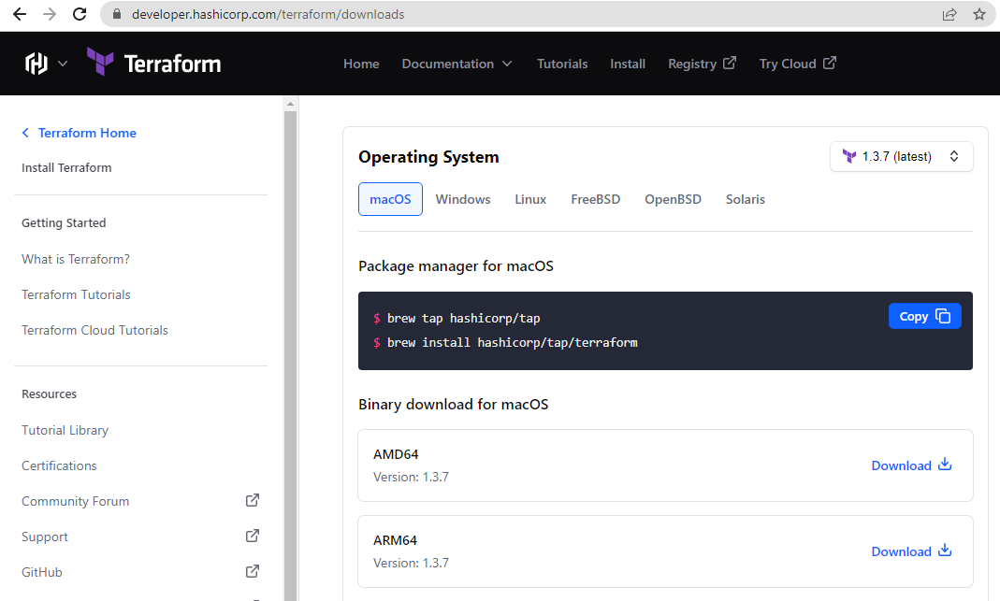
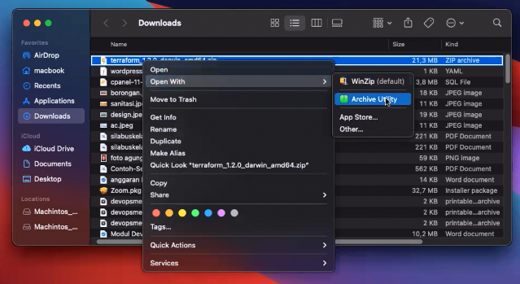

# Terraform

Terraform dikembangkan oleh HashiCorp yang merupakan tools infrastruktur as a code sebagai alat yang memungkinkan untuk membuat, mengubah, dan meningkatkan infrastuktur dengan aman dan dapat diprediksi. Terraform dikembangkan dalam bahasa Go. Terraform mendukung provision di berbagai provider cloud yang besar seperti AWS, GCP, Azure, bahkan DigitalOcean.

Referensi [Install Terraform](https://learn.hashicorp.com/tutorials/terraform/install-cli).
Referensi [Install AWS CLI](https://docs.aws.amazon.com/cli/latest/userguide/getting-started-install.html)


 ## Install Terraform di MAC OS

1. Download terraform di https://developer.hashicorp.com/terraform/downloads / https://awscli.amazonaws.com/AWSCLIV2.pkg
 
    

2. Extract file terraform

    

3. install terraform di terminal dengan perintah :
   ```sh
   mv /Downloads/terraform /usr/local/bin/terraform
   ```

    

4. Untuk mengkonfirmasi terinsall, dapat dilakukan dengan mengetikan command berikut di terminal.
   ```sh
   aws --version
   ```
   
## Create User AWS CLI
1. Login akun root https://aws.amazon.com/ anda dan search IAM
2. Buat user IAM baru di menu `User Management` - `User`, pilih `Add Users`
3. Buat `user name` baru, pada `Select AWS access type` ceklist `acccess key` lalu klik `Next Permissions`
4. Pilih `Attach existing polices directly` ceklist `AdministratorAccess` lalu klik `Next: Tags`
5. key isi `name` Value (Optional) isi `devops` lalu klik `Next: Review`
6. Klik `Create User`, `Access Key ID` dan `Secret access key` sudah dibuat.
7. Pada termnal klik `aws configure` isi `AWS Access Key ID` dan `AWS Secret Access Key` yang ada di akun aws, untuk region isi `ap-southeast-1`, `json` klik `Enter`

## Menjalankan terraform

1. Inisialisasi provider
   ```sh
   terraform init
   ```
2. Melihat detail resource sebelum dibuat
   ```sh
   terraform plan
   ```
3. Apply resource
   ```sh
   terraform apply
   ```
