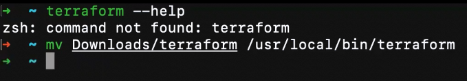

## Terraform

Terraform dikembangkan oleh HashiCorp yang merupakan tools infrastruktur as a code sebagai alat yang memungkinkan untuk membuat, mengubah, dan meningkatkan infrastuktur dengan aman dan dapat diprediksi. Terraform dikembangkan dalam bahasa Go. Terraform mendukung provision di berbagai provider cloud yang besar seperti AWS, GCP, Azure, bahkan DigitalOcean.

Referensi [Install Terraform](https://learn.hashicorp.com/tutorials/terraform/install-cli).

 ## Install Terraform di MAC OS

1. Download terraform di https://developer.hashicorp.com/terraform/downloads

  

2. Extract file terraform

  

3. install terraform di terminal dengan perintah :
```sh
mv /Downloads/terraform /usr/local/bin/terraform
```

  
